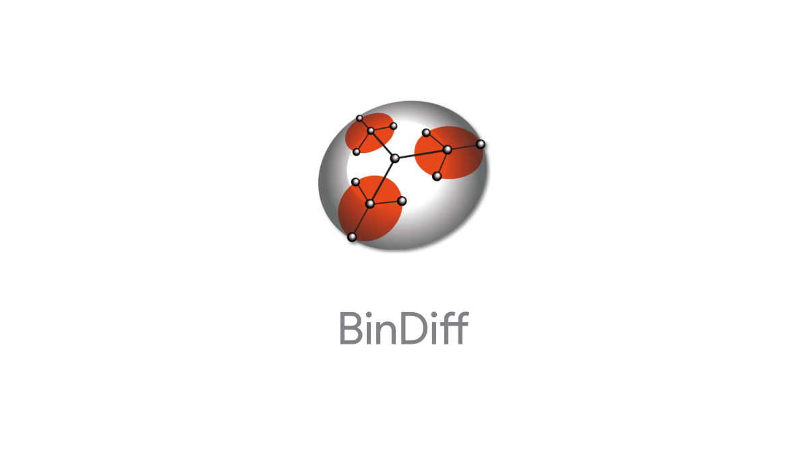

Copyright 2011-2024 Google LLC.

# BinDiff

This repository contains the BinDiff source code. BinDiff is an open-source
comparison tool for binary files to quickly find differences and similarities
in disassembled code.

## Table of Contents

- [About BinDiff](#about-bindiff)
- [Quickstart](#quickstart)
- [Documentation](#documentation)
- [Codemap](#codemap)
- [Building from Source](#building-from-source)
- [License](#license)
- [Getting Involved](#getting-involved)

## About BinDiff

BinDiff is an open-source comparison tool for binary files, that assists
vulnerability researchers and engineers to quickly find differences and
similarities in disassembled code.

With BinDiff, researchers can identify and isolate fixes for vulnerabilities in
vendor-supplied patches. It can also be used to port symbols and comments
between disassemblies of multiple versions of the same binary. This makes
tracking changes over time easier and allows organizations to retain analysis
results and enables knowledge transfer among binary analysts.

### Use Cases

* Compare binary files for x86, MIPS, ARM, PowerPC, and other architectures
  supported by popular [disassemblers](docs/disassemblers.md).
* Identify identical and similar functions in different binaries
* Port function names, comments and local names from one disassembly to the
  other
* Detect and highlight changes between two variants of the same function

## Quickstart

If you want to just get started using BinDiff, download prebuilt installation
packages from the
[releases page](https://github.com/google/bindiff/releases).

Note: BinDiff relies on a separate disassembler. Out of the box, it ships with
support for IDA Pro, Binary Ninja and Ghidra. The [disassemblers page](docs/disassemblers.md) lists the supported configurations.

## Documentation

A subset of the existing [manual](https://www.zynamics.com/bindiff/manual) is
available in the [`docs/` directory](docs/README.md).

## Codemap

BinDiff contains the following components:

* [`cmake`](cmake) - CMake build files declaring external dependencies
* [`fixtures`](fixtures) - A collection of test files to exercise the BinDiff
  core engine
* [`ida`](ida) - Integration with the IDA Pro disassembler
* [`java`](java) - Java source code. This contains the the BinDiff visual diff
  user interface and its corresponding utility library.
* [`match`](match) - Matching algorithms for the BinDiff core engine
* [`packaging`](packaging) - Package sources for the installation packages
* [`tools`](tools) - Helper executables that are shipped with the product

## Building from Source

The instruction below should be enough to build both the native code and the
Java based components.

More detailed build instructions will be added at a later date. This includes
ready-made `Dockerfile`s and scripts for building the installation packages.

### Native code

BinDiff uses CMake to generate its build files for those components that consist
of native C++ code.

The following build dependencies are required:

*   [BinExport](https://github.com/google/binexport) 12, the companion plugin
    to BinDiff that also contains a lot of shared code
*   Boost 1.83.0 or higher (a partial copy of 1.83.0 ships with BinExport and
    will be used automatically)
*   [CMake](https://cmake.org/download/) 3.14 or higher
*   [Ninja](https://ninja-build.org/) for speedy builds
*   GCC 9 or a recent version of Clang on Linux/macOS. On Windows, use the
    Visual Studio 2019 compiler and the Windows SDK for Windows 10.
*   Git 1.8 or higher
*   Dependencies that will be downloaded:
    *   Abseil, GoogleTest, Protocol Buffers (3.14), and SQLite3
    *   Binary Ninja SDK

The following build dependencies are optional:
*   IDA Pro only: IDA SDK 8.2 or higher (unpack into `deps/idasdk`)

The general build steps are the same on Windows, Linux and macOS. The following
shows the commands for Linux.

Download dependencies that won't be downloaded automatically:

```bash
mkdir -p build/out
git clone https://github.com/google/binexport build/binexport
unzip -q <path/to/idasdk_pro80.zip> -d build/idasdk
```

Next, configure the build directory and generate build files:

```bash
cmake -S . -B build/out -G Ninja \
  -DCMAKE_BUILD_TYPE=Release \
  -DCMAKE_INSTALL_PREFIX=build/out \
  -DBINDIFF_BINEXPORT_DIR=build/binexport \
  "-DIdaSdk_ROOT_DIR=${PWD}build/idasdk"
```

Finally, invoke the actual build. Binaries will be placed in
`build/out/bindiff-prefix`:

```bash
cmake --build build/out --config Release
(cd build/out; ctest --build-config Release --output-on-failure)
cmake --install build/out --config Release
```

### Building without IDA

To build without IDA, simply change the above configuration step to

```bash
cmake -S . -B build/out -G Ninja \
  -DCMAKE_BUILD_TYPE=Release \
  -DCMAKE_INSTALL_PREFIX=build/out \
  -DBINDIFF_BINEXPORT_DIR=build/binexport \
  -DBINEXPORT_ENABLE_IDAPRO=OFF
```

### Java GUI and yFiles

Building the Java based GUI requires the commercial third-party graph
visualisation library [yFiles](https://www.yworks.com/products/yfiles) for graph
display and layout. This library is immensely powerful, and not easily
replaceable.

To build, BinDiff uses Gradle 6.x and Java 11 LTS. Refer to its
[installation guide](https://docs.gradle.org/6.8.3/userguide/installation.html)
for instructions on how to install.

Assuming you are a yFiles license holder, set the `YFILES_DIR` environment
variable to a directory containing the yFiles `y.jar` and `ysvg.jar`.

Note: BinDiff still uses the older 2.x branch of yFiles.

Then invoke Gradle to download external dependencies and build:

Windows:
```
set YFILES_DIR=<path\to\yfiles_2.17>
cd java
gradle shadowJar
```

Linux or macOS:

```
export YFILES_DIR=<path/to/yfiles_2.17>
cd java
gradle shadowJar
```

Afterwards the directory `ui/build/libs` in the `java` sub-directory should
contain the self-contained `bindiff-ui-all.jar` artifact, which can be run
using the standard `java -jar` command.

## Further reading / Similar tools

The original papers outlining the general ideas behind BinDiff:

* Thomas Dullien and Rolf Rolles. *Graph-Based Comparison of Executable
  Objects*. [bindiffsstic05-1.pdf](docs/papers/bindiffsstic05-1.pdf).
  SSTIC ’05, Symposium sur la Sécurité des Technologies de l’Information et des
  Communications. 2005.
* Halvar Flake. *Structural Comparison of Executable Objects*.
  [dimva_paper2.pdf](docs/papers/dimva_paper2.pdf). pp 161-173. Detection of
  Intrusions and Malware & Vulnerability Assessment. 2004.3-88579-375-X.

Other tools in the same problem space:

* [Diaphora](https://github.com/joxeankoret/diaphora), an advanced program
  diffing tool implementing many of the same ideas.
* [TurboDiff](https://www.coresecurity.com/core-labs/open-source-tools/turbodiff-cs), a now-defunct program diffing plugin for IDA Pro.

Projects using BinDiff:

* [VxSig](https://github.com/google/vxsig), a tool to automatically generate
  AV byte signatures from sets of similar binaries.

## License

BinDiff is licensed under the terms of the Apache license. See
[LICENSE](LICENSE) for more information.

## Getting Involved

If you want to contribute, please read [CONTRIBUTING.md](CONTRIBUTING.md)
before sending pull requests. You can also report bugs or file feature
requests.
